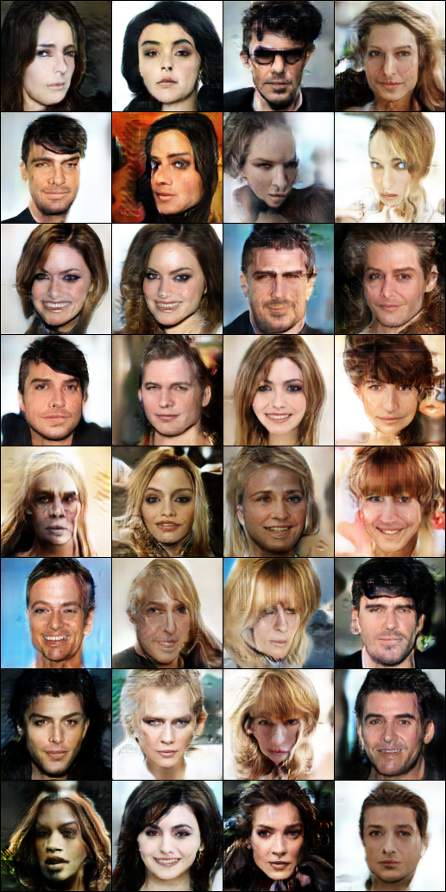

# SAGAN
PyTorch Implementation of Self-Attention GAN (SAGAN) (Check the original paper: https://arxiv.org/abs/1805.08318).

This implementation closely matches the official Tensorflow implementation (https://github.com/brain-research/self-attention-gan) but differs in the following way:

1. The Conditional BatchNorm layers in the original implementation were replaced with `nn.BatchNorm2d` as the provided implementation trains an Unconditional SAGAN.

## Datasets Used:
We used high-quality images from the CelebA-MaskHQ Dataset to train the SAGAN model.(See: https://github.com/switchablenorms/CelebAMask-HQ)

## Dataset Setup
This implementation supports the **CelebA** and the **CelebA-Mask HQ** datasets and expects you to have downloaded them. If you want to use a custom dataset, a new PyTorch `Dataset` would need to be setup!

## Training

The file `train.py` is the entry point for all training. Do a simple
`python train.py train --help` to see the available options in the CLI.

A sample training command (for reference):
```
python train.py train --subsample 10000 --chkpt-interval 10 --batch-size 32 --n-workers 2 --results-dir /content/sagan/ --restore-path /path/to/checkpoint --n-epochs 100 /path/to/dataset/root/
```
will train the SAGAN architecture by using a subsample of 10000 images from the provided dataset.

## Samples

Some generated samples (128 x 128 resolution) after training on the CelebA-Mask HQ dataset for around 60000 steps. The model has around 6M params (which is less) so some weird artifacts in the image samples are noticeable.

<p float='left' align='center'>


</p>

## Author
Kushagra Pandey (@kpandey008)
